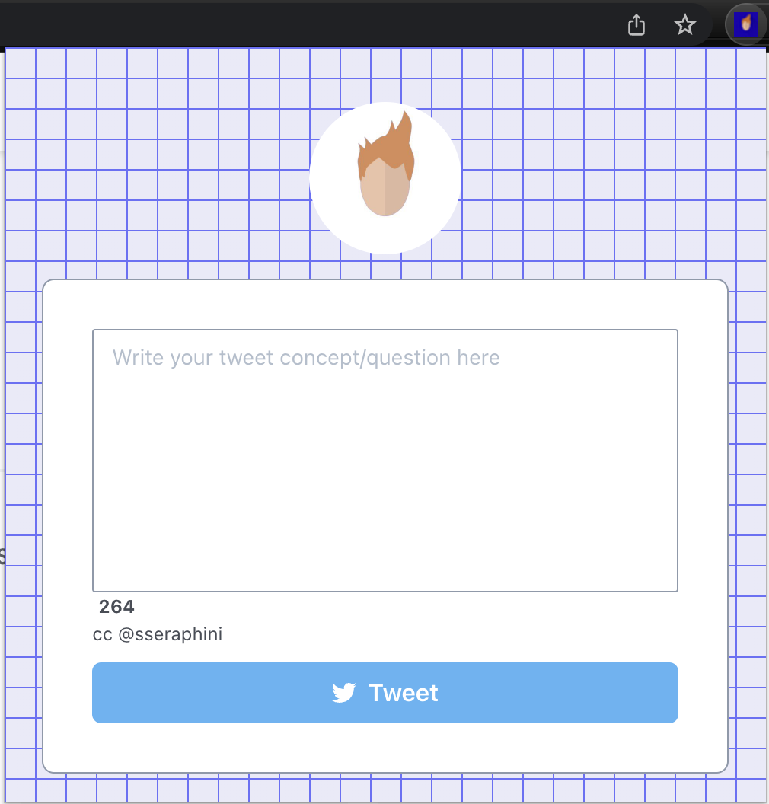
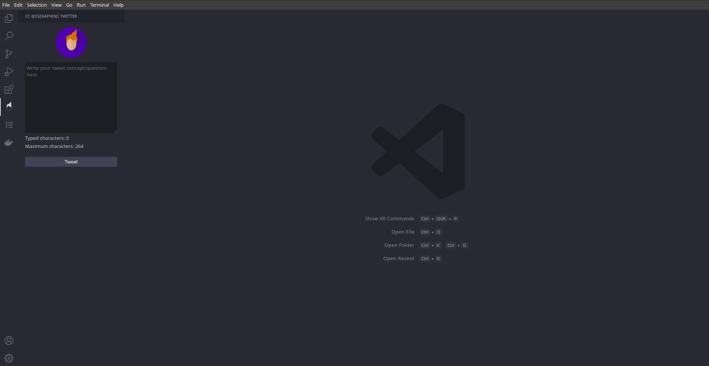
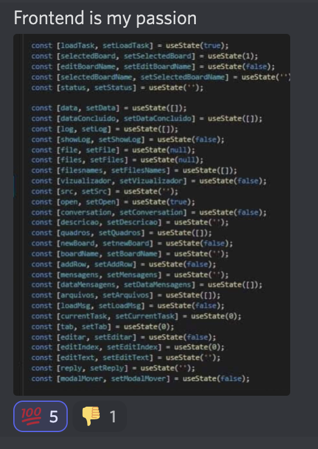

import { Head } from "mdx-deck";

import { Cover } from "./Cover";
import { Img } from "./Img";
import { Feedback } from "./Feedback";
import { Intro } from './Intro';

export { default as theme } from "./theme";

<Head>
  <title>Human Automation</title>
</Head>

<Cover />

---

<Intro />

---

---

# Stats

- 1238 commits
- 34 contributors

---

# Apps

- Webapp
- Cli
- Chrome Extension
- VSCode Extension
- Memes Bot
- Distributed Retweet Bot

---

# Web

- [https://sseraphini.cc](https://sseraphini.cc)

---

# CLI

- [npx ccsseraphini](https://www.npmjs.com/package/ccsseraphini)

---

# Chrome Extension

- [Chrome Extension](https://chrome.google.com/webstore/detail/ccsseraphini/jbdolkjfpfgpbdeeebkhnmfnbkplgalm)

---

# VSCode

- [VSCode ccsseraphini](https://marketplace.visualstudio.com/items?itemName=adsonatural.ccsseraphini)

---

# SSeramemes

- [SSeramemes](https://github.com/sibelius/ccsseraphini/tree/main/apps/sseramemes)
- Share memes based on discord community suggestions

---

# SSeramemes Voting

---

# ccsseraphini bot

- Let community decide what to Retweet
- [Code](https://github.com/sibelius/ccsseraphini/tree/main/apps/bot)

---

# ccsseraphini bot in action

---

# Next Steps

- Auto respond bot
- Auto retweet bot
- Always retweet paid tweets

---

## References

- [https://sseraphini.cc](https://sseraphini.cc)
- [npx ccsseraphini](https://www.npmjs.com/package/ccsseraphini)
- [Chrome Extension](https://chrome.google.com/webstore/detail/ccsseraphini/jbdolkjfpfgpbdeeebkhnmfnbkplgalm)
- [VSCode ccsseraphini](https://marketplace.visualstudio.com/items?itemName=adsonatural.ccsseraphini)

---

<Feedback />
